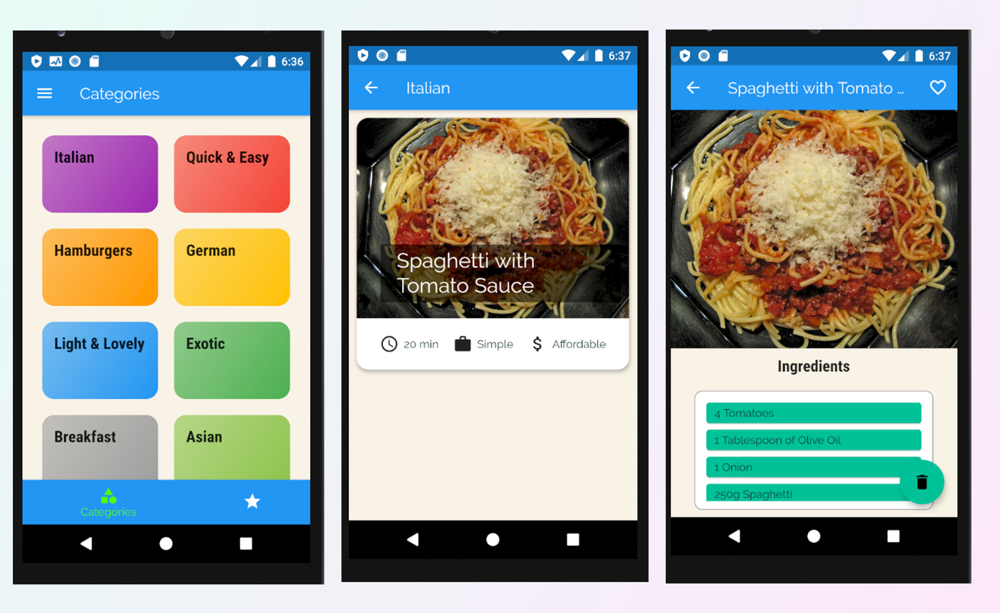

# cookingAppFlutter
Simple Cooking App using Flutter, that allows you to categorize your meals and save your recipes for a meal.

# Features
- You can save ingredients and steps to make your previous meal.
- You can save them in this app
- You can favourite some meals to your preference

# Technologies
 ### Flutter
 
 # Previews
 

 
 # License
 **MIT License**
 Free Software Hell Yeah!
